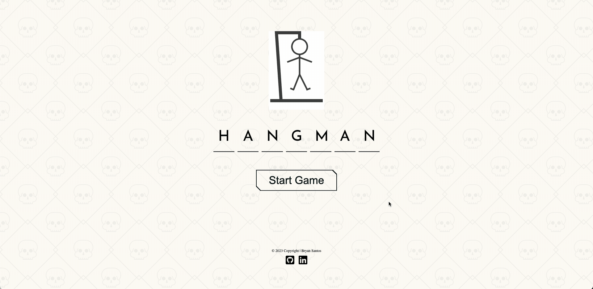
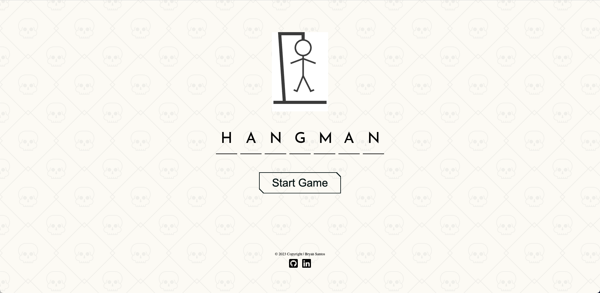
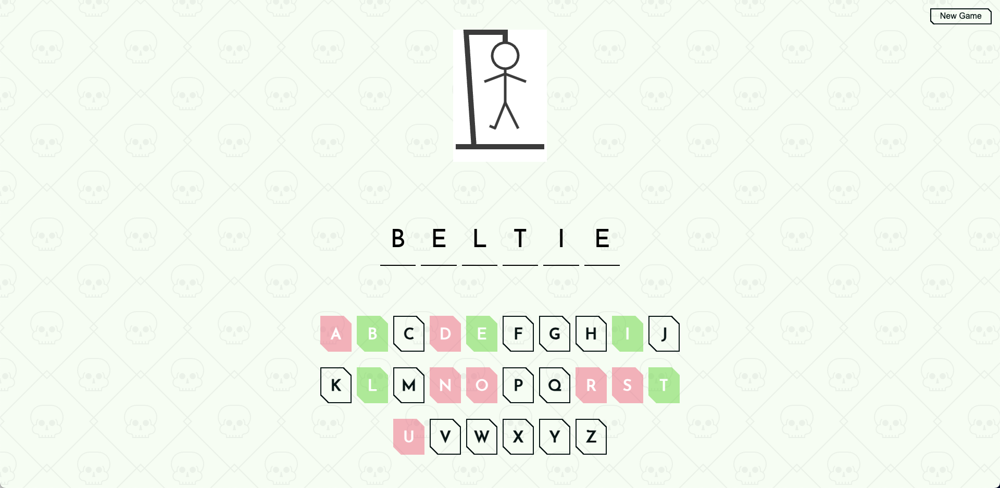

# [Hangman](https://bryandevelops.github.io/Hangman/)

#### Description
**Hangman** is a guessing game played in the browser where players are tasked with guessing letters to form a secret word. The object of Hangman is to guess the secret word before the stick figure is hung. The player takes turns selecting letters to narrow the word down.

## Rules
- The player clicks 'Start Game' and selects a difficulty
- The player clicks 'Confirm' to initiate a new game
- The player clicks on a letter on the visual keyboard to guess a letter
- If the guessed letter is in the word,
  - the blank spaces of the secret word are filled with the guessed letter at the corresponding positions
  - the guessed letter's color on the visual keyboard is changed to green to indicate to the player that it was a correctly guessed letter
- If the guessed letter is not in the word,
  - a body part gets drawn onto the canvas
  - the guessed letter's color on the visual keyboard is changed to red to indicate to the player that it was an incorrectly guessed letter
- After a guess, the player is to continue guessing until they either Win or Lose
- After a correct guess, if the secret word is completed, the player wins and they are able to click on the word to check its dictionary definition
- After an incorrect guess, if the stick figure is fully drawn, the player loses and they are able to click on the word to check its dictionary definition
- At any point after starting a game, the player is able to start a new game and guess a new word

## Future Functionality

The following **optional** features are to be implemented in the future:

- [x] Difficulty Modes
  - The player will be able to select a difficulty (Easy, Moderate, Hard) which will determine the length of the secret word they need to guess

## Flowchart & Wireframe

Here is my initial flowchart and wireframe I created during the planning stage:

## Demo

Here is a quick demonstration of the game in action:

## Images

1. ###### Game Start

2. ###### Game Win

3. ###### Game Lose

## Play Game

[Give it a try!](https://bryandevelops.github.io/Hangman/)

## Resources

- Hangman Canvas: https://codepen.io/xavier_bs/pen/MMNGyG
- CSS Background Pattern: https://heropatterns.com/
- English Words: https://github.com/dwyl/english-words
- Cut Corner Buttons: https://codepen.io/t_afif/pen/bGooZmq
- Transitioning Glow On Text: https://unused-css.com/blog/css-outer-glow/